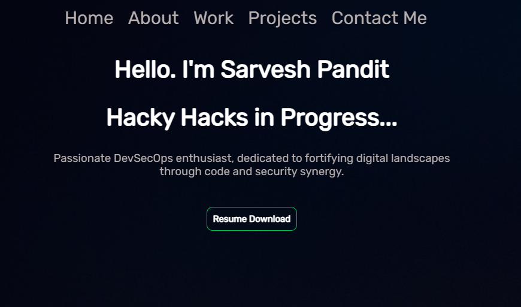

# Personal Portfolio



This is my Personal Portfolio [crystaxit.github.io](https://crystaxit.github.io/) which features my personal projects as well as my Resume

## Built using

- HTML
- CSS
- JavaScript
- Python

## Pre-requisite

This program has no pre-requisites

## Installation

You can fork this repo to modify and make changes of your own. Please give me proper credit. Thanks! 😊

1. Clone this repo
```bash
git clone https://github.com/crystaxit/crystaxit.github.io.git
```
2. Run Index.html file
3. Have Fun
